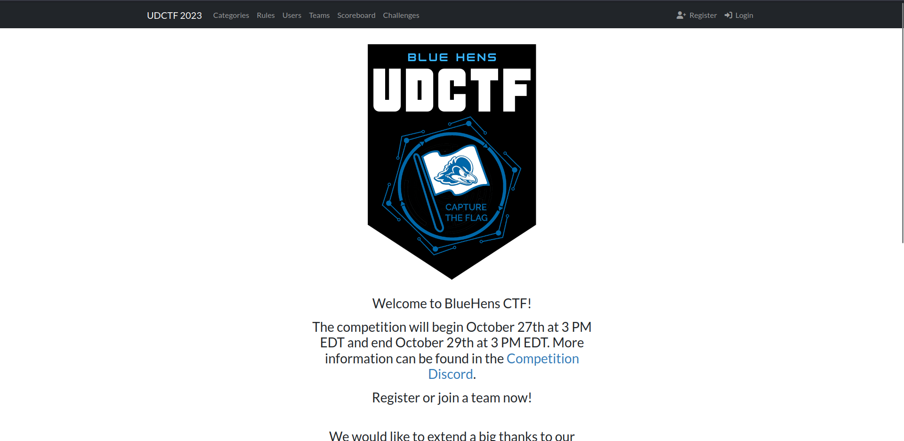

# BlueHens CTF 2k23 Write-Ups

Welcome to BlueHens CTF 2k23 Challenges' Write-Ups Repository, you can find all detailed solutions of each ctf's challenge.

## Introduction 

A jeopardy-style CTF organized by the University of Delaware's own CTF team, that covers topics from crypto and pwn to rev and web. High-school, undergraduate, graduate, mixed, and professional teams with up to four members are allowed to compete in separate buckets. This competition is supported by the Electrical and Computer Engineering Department, Center for Cybersecurity, Assurance and Privacy, Trustworthy Computing Group, Cloud Crypto VIP Team, and Cyber Scholars at the University of Delaware.

## Content

 - [Cryptography](./crypto/)
 - [Web Exploitation](./web/)
 - [Binary Exploitation](./pwn/)
 - [Miscellaneous](./misc/)
